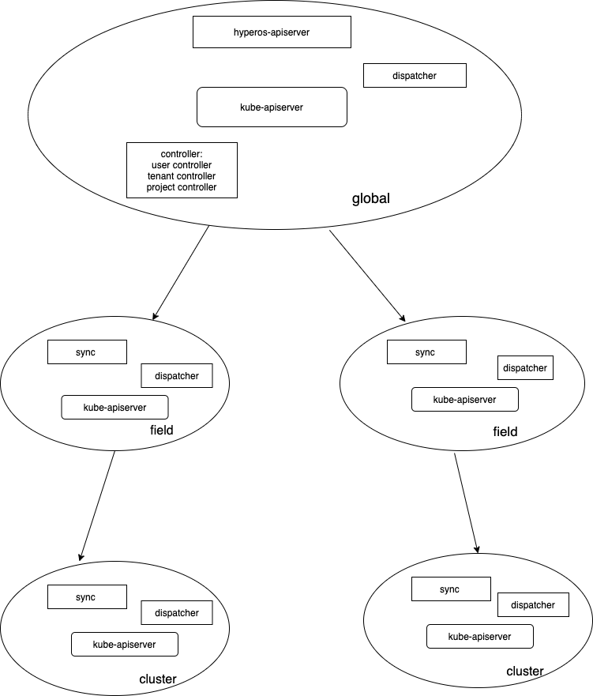

# 毕设多租户权限设计

## 背景

对用户获得集群的信息做逻辑上的隔离。 在用户发起请求的时候，我们需要证明用户是用户和用户是否有权限做这个操作。k8s集群的最小逻辑隔离单位一般是namespace， 怎么把多个集群的namespace组织起来，使得用户在多个集群上有自己的namespace，在操纵台能对多个集群的namespace里的资源做出统一管理。

另外，比如用户请求pod信息的时候，请求发送给global请求，但是pod的信息并不保存在global中，他保存在cluster层，我们需要把请求转发各个cluster层，并把请求汇总。

当请求转发给cluster或field层需要对用户的请求是否这个权限获取信息作出判断。


# 总体设计



hyperos-apiserver： 完成对用户请求的认证，鉴权功能，并且对用户的增删改查的请求转发给kube-apiserver。 get请求转发给dispatcher处理。

sync组件： 完成对管控集群中user， namesapce， rbac规则的同步，同步给被管控集群。

dispatcher： 接收到请求后，转发给各个被管控集群处理请求并把请求的回复合并发给客户端。

以及多租户有关的crd的controller。

主要目的就是： 管控集群和被管控集群的user和rbac具有相同的用户和权限信息， 当用户的请求的时候携带用户信息可在被管控集群中完成认证鉴权信息。

namespace设计：

**问题： namespace是否要加后缀？？** 

global上租户的项目namespace为： 租户ID+projectID

field上租户的项目的namespace为：租户ID+projectID+XXX

cluster租户的项目的namespace为：租户ID+projectID+XXXX


### 用户系统：

问题一： 密码怎么保存？：md5直接保存在etcd中。

在多集群内添加user CRD资源。在global集群创建后，同步给各层集群，做多集群的统一认证？？？？ 

```
apiVersion: user.hyperos.io/v1
kind: User
metadata:
	name: 登录账号，用户唯一标识，系统生成，不可重复，不可修改
spec:
	password: 密码，必填，系统会将密码进行md5加密后保存
	displayName: 用户名
	email: 邮箱
	phone: 电话
	language: 语言：en/ch
	loginType: 用户登录方式：normal/ldap/github/...
	state: 用户状态：normal/forbidden
status:
	lastLoginTime: 上次登录时间
	lastLoginIp: 上次登录IP
```

#### 用户层次

分成系统管理员，租户管理员，项目管理员，普通用户四层用户模型。

系统管理员

租户管理员

项目管理员

普通用户：支持对用户权限的自定义。


### 身份认证

问题二： 需要支持哪几种认证方式？

LADP 

openID 

GitHub:

可以考虑用keycloak开源工具

#### 授权

RBAC模型

### 租户模型

租户层次模型：

租户： 对应一个企业或者一个组织

项目： 一个租户下可以包括多个项目，一个项目对应的一个命名空间，tenantID-projectID


预设四种角色：

平台管理员：

租户管理员：拥有某个租户的所有权限，主要负责租户下的[项目管理](https://cloud.tencent.com/product/coding-pm?from=10680)。

项目管理员：拥有这个命令空间的所有权限

项目观察员：仅拥有项目下命名空间和资源的查询权限，可以查看应用日志和监控。


#### tenant API设计

```
apiVersion: tenant.hyperos.io/v1
kind: Tenant
metadata:
	name:  // tenant资源名称
spec:
	displsyName：租户名称
	tenantadmin： 租户管理员
	password: 密码，必填，系统会将密码进行md5加密后保存
	state: 租户状态
	namespace： 租户的命名空间
status:
	
```

租户状态：

1. initializing： 该tenant资源通过参数验证刚被系统所接受
2. pending： 该tenant资源对象正在被租户控制器所处理中
3. active：该tenant资源对象可用
4. failed： 该tenant资源不可用
5. terminating： 该tenant资源对象正在优雅删除


#### project API设计

```
apiVersion: project.hyperos.io/v1
kind: Project
metadata:
	name: // projec名称
spec:
	tenant： 所属租户
	namespace： 租户项目的命名空间（tenantID+projectID）
status:
```

### 创建租户流程

1. 首先拥有平台权限的平台管理员调用tenant api创建tenant资源对象
2. tenant-controller通过kubernetes的List&watch机制获取新创建的tenant资源对象的事件。
3. tenant-controller 生成命名空间，写会给apiserver。 根据yaml文件的配置，生成一个用户作为租户管理员。

应该返回给用户一个租户管理员的账号，所以应该创建租户管理员角色tenantadminrole和 tenantadminrolebinding。

### 删除租户流程

删除tenant 以及和他有关的project，以及租户有关的角色信息。


### 创建项目流程


1. 首先拥有租户管理权限的租户管理员调用project api创建project资源对象。
2. project-controller通过kubernetes的List&watch机制获取新创建的project资源对象的事件
3. project-controller生成命名空间，写回给apiserver
4. 。。。。。。    等一等想


### 配额系统

还没想


## 各组件功能详细设计

#### hyperos- apiserver


#### dispacher


####  sync


#### 各个crd的congtroller

##### usercontroller

##### tenantcontroller

##### projectcontroller

